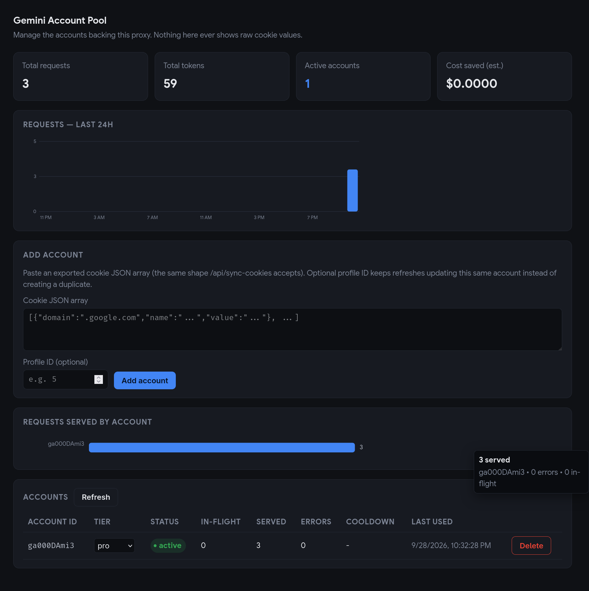

# Free Gemini API Suite

High-throughput, OpenAI-compatible proxy engine powered by Google Gemini 3.8 Flash, featuring pure Go HTTP/3 QUIC transport, distributed multi-account worker pooling, and the Needle 2 SLM function calling engine.

---

## Key Highlights

- **OpenAI API Standard**: Drop-in replacement for OpenAI endpoints (`/v1/chat/completions`, `/v1/models`).
- **Distributed Account Pooling**: Aggregates multiple Google accounts into an autonomous worker pool with least-busy routing and rate-limit circuit breakers.
- **Autonomous Local Network Discovery**: Lightweight Chrome extension dynamically discovers and links with the server across local networks with zero configuration.
- **Needle 2 SLM Tool Routing**: Sub-millisecond zero-shot function calling and schema extraction via native C++ shared library execution.
- **Admin Dashboard**: Token-gated web UI to manage the account pool — live usage charts, per-account health, manual tier labels (normal/pro/ultra), and add/remove accounts without touching the filesystem.
- **Zero-Tab Extraction**: Non-intrusive cookie bridge extracts essential session state directly from browser memory without opening, reloading, or focusing browser tabs.
- **Production Resilience**: Built on HTTP/3 QUIC with TLS fingerprint simulation, automatic failover, and dual persistence (SQLite WAL + JSON/Excel analytics).

---

## System Architecture

```
[ Clients / OpenAI SDKs / Agents ]
              │
              ▼
   ┌────────────────────────────────────────┐
   │         Free Gemini API Server         │
   │  (Port 8001: HTTP/3 | Port 9226: WS)   │
   └──────────────────┬─────────────────────┘
                      │
        ┌─────────────┴─────────────┐
        ▼                           ▼
 ┌──────────────┐            ┌──────────────┐
 │ Worker Pool  │            │ Needle 2 C++ │
 │ (Least-Busy) │            │ Tool Engine  │
 └──────┬───────┘            └──────────────┘
        │
        ├──────────────────────────┐
        ▼                          ▼
 ┌──────────────┐           ┌──────────────┐
 │ Account 1..N │           │  Chrome Ext  │
 │ Google Cloud │           │  (Auto-Sync) │
 └──────────────┘           └──────────────┘
```

---

## Quickstart

### Prerequisites
- Docker & Docker Compose **or** Go 1.22+
- Google Chrome (for the companion session synchronizer)

### Option 1: Docker Deployment (Recommended)

```bash
# Clone the repository
git clone https://github.com/kodelyx/free-gemini-api.git
cd free-gemini-api/free-gemini-api

# Build and launch daemon
docker compose up -d --build
```

The server binds to port `8001` (HTTP API) and port `9226` (WebSocket Cookie Bridge). To remap the host-side API port (e.g. `8001` is already taken on that machine), set `HOST_API_PORT` in a `.env` file next to `docker-compose.yml` — no need to edit the tracked compose file:

```bash
echo "HOST_API_PORT=8009" > free-gemini-api/.env
```

### Option 2: Native Build

```bash
cd free-gemini-api
go run main.go
```

---

## Extension Installation

The extension extracts session credentials from active Google sessions and streams them to the local worker pool.

1. Open `chrome://extensions/` in your browser.
2. Enable **Developer mode** in the upper-right corner.
3. Click **Load unpacked** and select the [`gemini-extension/`](./gemini-extension) directory.
4. Ensure you are logged into [gemini.google.com](https://gemini.google.com).
5. The extension automatically discovers the server and registers the account into the active worker pool.

> **Multi-Device Support**: Deploy the extension across multiple workstations on your local network to aggregate accounts into a centralized high-capacity pool.

---

## Admin Dashboard

A token-gated web UI at `/admin` for managing the account pool without shelling into the container — usage charts, per-account health, manual tier labels, and account add/remove.



**Signing in:** on first boot, if `ADMIN_TOKEN` isn't set in the environment, a random token is generated and printed to the logs:

```bash
docker logs free-gemini-api | grep "Admin UI token"
```

Paste that token into `/admin` to sign in. Without a fixed `ADMIN_TOKEN`, a new token is generated on every container restart. To keep it stable, set it explicitly in `docker-compose.yml`:

```yaml
environment:
  - ADMIN_TOKEN=your-own-fixed-secret-here
```

**What it does:**
- **Usage charts** — requests over the last 24h, and requests served per account.
- **Account table** — live health (`active` / `cooldown` / `recovering`), in-flight/served/error counts, last-used time.
- **Tiers** — label each account `normal` / `pro` / `ultra` (a manual note for your own routing/bookkeeping, not something scraped from Google).
- **Add account** — paste an exported cookie JSON array (the same shape `/api/sync-cookies` accepts) instead of relying solely on the Chrome extension.
- **Delete account** — removes the cookie file and drops it from the pool immediately.

The page itself holds no data, but every `/admin/api/*` call requires `Authorization: Bearer <token>`. `/api/sync-cookies` (used by the Chrome extension and farm tooling) is intentionally left unauthenticated, unchanged.

---

## API Reference

### Core Endpoints

| Method | Endpoint | Description |
|---|---|---|
| `POST` | `/v1/chat/completions` | OpenAI-compatible chat & streaming completions |
| `GET` | `/v1/models` | List active models (`gemini-3.8-flash`) |
| `GET` | `/v1/workers` | Real-time worker pool health and concurrency metrics |
| `GET` | `/health` | Service health, session TTL, and worker count |
| `GET` | `/stats` | SQLite usage metrics and token accounting |
| `GET` | `/help` | Terminal-formatted developer CLI guide |
| `GET` | `/admin` | Account pool admin dashboard (token-gated) |
| `GET` | `/admin/api/accounts` | List accounts with tier + live health (requires `Authorization: Bearer <token>`) |
| `PUT` | `/admin/api/accounts/:id/tier` | Set an account's tier label (requires token) |
| `DELETE` | `/admin/api/accounts/:id` | Remove an account from the pool (requires token) |
| `GET` | `/admin/api/usage` | Hourly request counts + aggregate stats for the dashboard charts (requires token) |

### Example Request

```bash
curl -X POST http://localhost:8001/v1/chat/completions \
  -H "Content-Type: application/json" \
  -d '{
    "model": "gemini-3.8-flash",
    "messages": [
      {"role": "user", "content": "Explain quantum computing in one sentence."}
    ]
  }'
```

### Multi-Agent Sticky Routing

To bind an agent conversation to a specific worker account across multiple turns, supply the `X-Agent-ID` header:

```bash
curl -X POST http://localhost:8001/v1/chat/completions \
  -H "Content-Type: application/json" \
  -H "X-Agent-ID: agent-alpha" \
  -d '{
    "model": "gemini-3.8-flash",
    "messages": [{"role": "user", "content": "Analyze system requirements."}]
  }'
```

---

## Configuration & CLI

```bash
./goapi --help              # Display CLI manual and runtime configuration
./goapi --stats             # Print real-time analytics from terminal
./goapi --export out.xlsx   # Export comprehensive analytics to Excel
./goapi --mcp               # Launch as Model Context Protocol (MCP) server
```

---

## Security & Compliance

- **Zero Hardcoded Secrets**: Session tokens are maintained strictly in-memory and in local protected storage; credentials are never committed to version control.
- **Local Isolation**: All network discovery and synchronization operate strictly over local interfaces and designated client endpoints.
- **Non-Invasive Operation**: Background workers operate passively without tab manipulation, DOM scraping, or telemetry injection.

---

## License

MIT License. See [LICENSE](LICENSE) for details.
